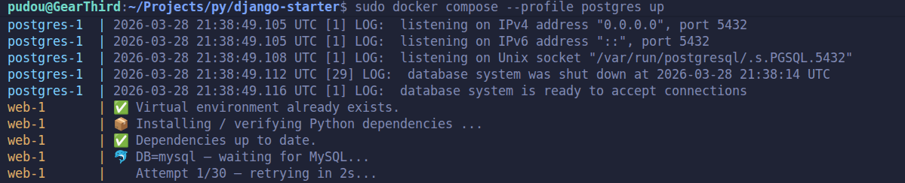

# Django Starter

Um projeto Django 5.2 LTS mínimo, estruturado para desenvolvimento colaborativo com Docker. Inclui suporte a três bancos de dados (SQLite, MySQL e PostgreSQL), configuração automática do ambiente no container e documentação pensada para quem está começando.

---

## Índice

1. [Introdução](#1-introdução)
    - [1.a — Introdução ao Docker](#1a--introdução-ao-docker)
    - [ 1.b — Introdução a Servidores Web e Django](#1b--introdução-a-servidores-web-e-django)
3. [Visão Geral do Projeto](#2-visão-geral-do-projeto)
4. [Como Rodar](#3-como-rodar)
5. [Estrutura do Projeto](#4-estrutura-do-projeto)

  (**+**) [_Pontos Pendentes (TODO)_](#pontos-pendentes-todo)

---

## 1. Introdução
A ideia deste repositório é criar um ambiente comum e fácil de rodar para todo mundo. Deixei o SQLite por padrão por ser mais simples de testar, mas a estrutura está aberta para mudarmos depois para bancos de dados com servidores dedicados, como MySQL ou Postgres. O foco aqui não é impor ferramentas, mas sim garantir que a gente trabalhe de um jeito mais  organizado desde o dia um, com ambientes que qualquer um consiga replicar. Antes de prosseguir, não se assuste com a maioria dos arquivos presentes no repositório. A maioria é para automatizar a subida de ambientes, etc. Para nosso projeto, importa mais a lógica, que ficará dentro da pasta [./src](./src). Ali estão os módulos `core` e `config`, estruturados da maneira já opinada com a qual o Framework Django nos faz organizar o código. Há mais detalhes sobre isso no [**guia para Django**](docs/guia-django.md).

Adianto também que é importante aprender e ter uma mínima disciplina com o Git. Recomendo bastante dar uma lida no [**guia para Git**](docs/guia-git.md) que deixei aqui para entender o fluxo de trabalho. Ela se resume, basicamente, a:
1. Sempre puxar as atualizações (pull)
2. Criar sua própria branch para mexer no código
3. Realizar alterações e prepará-las para o próximo commit (staging)
4. Realizar o commit, confirmando mais seriamente um grupo de alterações como salvas e identificadas, e 
5. Finalmente, publicar as mudanças no GitHub (push no remote).

<br>

Parece bastante coisa, mas rapidinho se torna um ritual o ciclo de pull, staging, commit e push. Isso vai evitar que a gente se atropele nas mudanças e facilitar a vida de todo mundo. Como não decidimos um banco, pré-configurei três para o Docker compose que podemos trocar até decidir, e depois remover os não usados. De qualquer modo, essa facilidade pra trocar de banco de dados já mostra tanto as vantagens de usar Docker, como demonstra onde o Django facilita a nossa vida, unificando a maneira de buscar e alterar dados do lado do código, independente do provedor de banco de dados. Cada um desses tópicos (Docker, Django e Git) possuem uma documentação dedicada e podemos rodar esse ambiente ao vivo, na máquina de cada um, juntos, sem problema.

<blockquote style="font-size:11.5pt;padding: 10px 6px;font-weight:575;">⚠️ Mais detalhes e comandos no <a href="docs/guia-git.md">guia de Git</a></blockquote>

---

### 1.a — Introdução ao Docker
#### O que é Docker?

Imagine que você está preparando uma receita e quer que um amigo em outro país reproduza exatamente o mesmo prato. Não só os ingredientes, mas o fogão, as medidas e a marca da farinha. Em vez de escrever instruções e torcer para que o ambiente dele seja idêntico, você entrega o prato já pronto, lacrado numa caixa que funciona em qualquer cozinha do mundo. Docker é essa caixa para software. De forma mais precisa, Docker é uma ferramenta que empacota uma aplicação junto com tudo o que ela precisa para funcionar: as bibliotecas do sistema operacional, a versão exata do Python, todos os arquivos de configuração, etc, em uma unidade portátil chamada **container**. Um container não é uma máquina virtual, ele é mais parecido com um processo isolado que compartilha o kernel Linux do host (então na prática, para Windows e Mac tem uma maquina virtual de fundo com linux como host do Docker). Esse container é um ambiente isolado que tem seu próprio sistema de arquivos, rede e espaço de processos.

#### Por que isso importa em projetos colaborativos?

O problema clássico em times de desenvolvimento é o famoso "na minha máquina funciona". Um desenvolvedor usa macOS com Python 3.11 instalado pelo Homebrew. Outro usa Windows 11 com Python 3.13 da Microsoft Store. Um terceiro faz o deploy num servidor Linux com Python 3.9. Cada ambiente tem pequenas diferenças de comportamento e bugs que aparecem em um lugar são invisíveis em outro. O Docker elimina completamente esse tipo de problema. O `Dockerfile` do projeto descreve o ambiente de forma precisa e reproduzível. Quando qualquer desenvolvedor (ou qualquer servidor) roda `docker compose up`, obtém exatamente a mesma versão do Python, as mesmas bibliotecas do sistema e a mesma configuração, sempre. O único pré-requisito é ter o Docker instalado. Apesar disso, nesse projeto, por enquanto o Docker está servindo ao propósito de organizar o ambiente local de desonvolvimento e nada impede que, em produção, façamos de outra maneira (inclusive sem Docker, se decidirmos assim).

Há três benefícios adicionais que vale mecionar. Primeiro, **isolamento**: cada projeto roda em seu próprio container, então instalar uma biblioteca para um projeto nunca quebra outro. Segundo, **descartabilidade**: você pode destruir e recriar um container em segundos, o que torna experimentos seguros. Terceiro, **paridade com produção**: o container que roda localmente poder ser o mesmo, em linhas gerais, que roda num servidor em nuvem, o que antecipa surpresas de deploy (deploy é sinônimo de colocar o servidor no ar em algum host, seja de teste, produção, etc).

---

### 1.b — Introdução a Servidores Web e Django

#### O que é um servidor web?

Quando você digita uma URL no navegador e pressiona Enter, seu navegador envia uma mensagem pela internet que diz, em essência, "por favor, envie o conteúdo desta página". Essa mensagem é uma requisição HTTP. Um **servidor web** é um programa que fica escutando essas mensagens e envia de volta respostas HTTP que podem ser páginas HTML, dados em formatoes de texto (JSON, XML), multimídia e arquivos.

Pense no servidor web como o porteiro da internet. Ele fica parado, esperando, aceita pedidos de visitantes e decide o que entregar de volta. Servidores web simples, como o Nginx servindo arquivos estáticos, apenas devolvem arquivos de uma pasta. Servidores mais sofisticados, apoiados por frameworks web, geram respostas dinamicamente: rodam código, consultam bancos de dados, aplicam regras de negócio (lógica) e constroem uma resposta personalizada para cada requisição.

#### O que é Django?

Django é um **framework web** para Python. Pense num framework web como uma caixa de ferramentas que te dá tudo o que você precisa para construir uma aplicação web sem reinventar a roda a cada vez. Roteamento de URLs, acesso a banco de dados, autenticação de usuários, validação de formulários, interfaces administrativas: o Django oferece soluções testadas em batalha para tudo isso. No núcleo do Django, o ciclo de vida de uma requisição funciona assim. Um navegador envia uma requisição HTTP para a porta 3333. O servidor de desenvolvimento do Django a recebe e consulta a configuração de URLs (`config/urls.py`) para descobrir qual função de view deve tratar essa URL. A função de view (`core/views.py`) executa a lógica, possivelmente consultando o banco de dados, e retorna uma resposta HTTP. No nosso caso, um `JsonResponse` com:
```json
{
  "id": "f9f4ecbb-c07c-4622-90df-7335443e54a5",
  "message": "Hello, Django!",
  "created_at": "2026-03-28T19:40:40.230Z",
  "db_backend": "sqlite3"
}
```

#### + ORM (Object-Relational Mapper) do Django
Nessa versão, exagerei no número de bancos de dados possíveis para a mesma aplicação (errei pra mais). Na próxima seção, há mais detalhes de como adaptar para rodar com cada provedor de banco de dados diferente. A ideia de fazer assim foi para demonstrar, na prática, um ponto forte de um Framework Web: O Django já vem com toda uma estrutura de como organizar a conexão, consulta e alteração do banco de dados sem precisar rodar nenhuma Query. Ao criar [migrations](./src/core/migrations/0001_test.py), ele já cria o tabela (`core_healthcheck`), se não existe, e implementa o model. Nessa versão, criamos uma tabela simples só para provar que é possível conectar e recuperar dados, que, depois, são usados para apresentar na resposta JSON retornada pelo servidor Django. Seja qual for o provedor, a forma de lidar com o banco através da aplicação Django permanece a mesma.

<blockquote style="font-size:11.5pt;padding: 10px 6px;font-weight:575;">⚠️ Mais detalhes e comandos no <a href="docs/guia-django.md">guia de Django</a></blockquote>

---

## 2. Visão Geral do Projeto

Este projeto usa uma arquitetura Docker com três componentes.

O **`Dockerfile`** define o ambiente base: Python 3.13 em uma imagem Debian (distribuição linux) enxuta, com pacotes do sistema para o cliente PostgreSQL e para a aplicação Django. Ele copia o código-fonte e o script `entrypoint.sh`, e declara a porta 3333.

O **`docker-compose.yml`** orquestra de um até dois serviços. O serviço `web` monta o container a partir do Dockerfile principal (no diretório raiz) e roda a aplicação Django. Se apenas ele rodar, o Django usará o `sqlite` como banco de dados. Mas, opcionalmente, é possível rodar perfis alternados, com o serviço `postgres` rodando a imagem oficial `postgres:17` ou, em vez deste, o serviço `mysql`, rodando a imagem oficial `mysql:8`. Ambos estão associado ao seu respectivo **profile** (`postgres` ou `mysql`) e só iniciam quando explicitamente chamados. A declaração `depends_on` do serviço `web` com `required: false` significa: "se `postgres` ou `mysql` estiverem rodando, espere o healthcheck passar (isto é, aguarde o banco estar disponível para conexão) antes de iniciar a aplicação Django. No caso de nenhum dos dois estar rodando, inicie imediatamente (com SQLite)".

O **`entrypoint.sh`** é o script executado dentro do container a cada inicialização. Ele cria o ambiente virtual Python se ainda não existir (persistido num volume Docker nomeado), instala as dependências, opcionalmente aguarda o MySQL ou PostgreSQL com um loop de retentativas de conexão e, após conectado, roda as migrations do Django para, por fim, iniciar o servidor web.

A seleção do banco de dados é controlada por dois mecanismos que precisam estar de acordo:
```
DB=postgres no .env   ←→   docker compose --profile postgres up
DB=mysql no .env   ←→   docker compose --profile mysql up
DB=sqlite   no .env   ←→   docker compose up
```

Se eles divergirem o Django tentará se conectar a um host que não está rodando no momento (seu container não foi subido) e falhará com erro de conexão. Por conta disso, é necessário sempre manter um único trecho do arquivo `.env` descomentado, como exemplificado no [.env.example](.env.example) que roda a aplicação Django conectando com o sqlite (padrão). Quando esse erro acontece, o script [`entrypoint.sh`](./entrypoint.sh) ficará imprimindo na tela as novas tentativas de conexão infinitamente. Segue um exemplo abaixo, onde o `.env` estava configurado para o MySQL, mas o perfil do `docker compose` selecionado foi o `postgres`:

<div align="center" style="width: 100%;margin-top:-6px";>
  
</div>

---

## 3. Como Rodar

Esta é a seção mais importante. Leia antes de executar qualquer comando.

### Pré-requisitos

1. Você precisa ter o Docker e o Docker Compose instalados. Caso ainda não tenha feito isso, siga o guia para o seu sistema operacional:

    - [Instalar no Linux](docs/linux-docker-install.md)
    - [Instalar no macOS](docs/macOS-docker-install.md)
    - [Instalar no Windows](docs/windows-docker-install.md)

    Para a referência oficial, acesse a documentação em [docs.docker.com](https://docs.docker.com).

2. No Windows, é necessário [instalar o Git](https://git-scm.com/book/pt-br/v2/Come%C3%A7ando-Instalando-o-Git#_instalando_no_windows).

### Passo 1 — Clone o repositório
```bash
git clone https://github.com/PI-Univesp-005/django-starter.git
cd django-starter # isso significa ir até a pasta onde criada pelo clone, pode ser feito com mouse, sem comando
```

<sub>OBS: Clone por https só funciona com repositórios **públicos**. Mantive este assim para facilitar. O ideal é que fosse privado e, para isso, seria necessário [configurar uma chave ssh](https://docs.github.com/pt/authentication/connecting-to-github-with-ssh). Podemos adiar isso, só se julgarmos realmente necessário deixar o repositório privado. Isso não importa muito por agora.</sub>

### Passo 2 — Crie o arquivo `.env`

O projeto requer um arquivo `.env` que o Docker Compose lê para as variáveis de ambiente. Um template de exemplo está disponível, copie ele e adapte os valores:

```bash
cp .env.example .env
```
<sup style="font-size: 8.5pt;"> O comando acima é o mesmo que compiar o arquivo do <code>.env.example</code> e depois renomá-lo para <code>.env</code></sup>

Abra o `.env` em qualquer editor de texto, caso queira mudar os valores.

### Passo 3.a — Rodar com SQLite (mais simples, sem banco externo)

O SQLite é um banco de dados baseado em arquivos, embutido no Python/Django. Nenhum serviço de banco de dados separado é necessário. O arquivo de banco é criado automaticamente dentro do container.

```bash
# Certifique-se de que o .env tem: DB=sqlite (exige acesso root no linux - sudo)
docker compose up
```

Acesse [http://localhost:3333](http://localhost:3333) e você verá algo como:

```json
{
  "id": "b3cb56e1-6aea-4e5e-aa20-ac5c53cdb227",
  "message": "Hello, Django!",
  "created_at": "2026-03-28T16:47:08.390Z",
  "db_backend": "sqlite3"
}
```

### Passo 3.b — Rodar com MySQL

Antes de rodar, certifique-se de que o `.env` tem estes valores:

```
DB=mysql
DB_NAME=django_db
DB_USER=django_user
DB_PASSWORD=django_password
DB_HOST=mysql
DB_PORT=3306
```
Em seguida, inicie ambos os serviços com o profile `mysql`:

```bash
docker compose --profile mysql up
```

Acesse [http://localhost:3333](http://localhost:3333) e você verá algo como:

```json
{
  "id": "b3cb56e1-6aea-4e5e-aa20-ac5c53cdb227",
  "message": "Hello, Django!",
  "created_at": "2026-03-28T16:47:08.390Z",
  "db_backend": "mysql"
}
```

O container `mysql` vai iniciar primeiro. O container `web` aguarda até o healthcheck do PostgreSQL passar (estar disponível para conexão), depois roda as migrations e inicia o Django.

### Passo 3.c — Rodar com PostgreSQL

Antes de rodar, certifique-se de que o `.env` tem estes valores:

```
DB=postgres
DB_NAME=django_db
DB_USER=django_user
DB_PASSWORD=django_password
DB_HOST=postgres
DB_PORT=5432
```
Em seguida, inicie ambos os serviços com o profile `postgres`:

```bash
docker compose --profile postgres up
```

Acesse [http://localhost:3333](http://localhost:3333) e você verá algo como:

```json
{
  "id": "b3cb56e1-6aea-4e5e-aa20-ac5c53cdb227",
  "message": "Hello, Django!",
  "created_at": "2026-03-28T16:47:08.390Z",
  "db_backend": "postgresql"
}
```

O container `postgres` vai iniciar primeiro. O container `web` aguarda até o healthcheck do PostgreSQL passa (estar disponível para conexão), depois roda as migrations e inicia o Django.

### Trocando entre bancos de dados

Para trocar de SQLite para PostgreSQL (ou vice-versa), pare os containers com `Ctrl+C` ou `docker compose down`, comente os valores do banco atual no `.env`, des moente o do novo banco que deseja rodar e reinicie com o comando indicado para cada caso, acima. **Por que tanto o `.env` quanto o profile do Compose precisam mudar?** Eles controlam camadas diferentes. O profile do Compose controla a *infraestrutura*: quais containers o Docker inicia. A variável `.env` controla o *comportamento da aplicação*: qual driver de banco (biblioteca Python usada na conexão) o Django usa e onde ele se conecta. Mudar um sem o outro cria uma incompatibilidade.

### Comandos úteis
<sup>Gerenciando os containers.</sup>

```bash
# Para e remove os containers web apenas (mantém os dados no SQLite, para remover é necessário adicionar as flags --build --force-recreate)
docker compose down

# Para e remove os containers web e mysql (mantém os dados no MySQL)
docker compose --profile mysql down 
# Para e remove os containers web e mysql, removendo volumes (deletando os dados do MySQL)
docker compose --profile mysql down -v 

# Para e remove os containers web e postgres (mantém os dados no PostgreSQL)
docker compose --profile postgres down
# Para e remove os containers web e postgres, removendo volumes (deletando os dados do PostgreSQL)
docker compose --profile postgres down -v 

docker compose exec web bash # Abre um shell dentro do container web (linha de comando dentro do Docker)
docker compose logs -f       # Exibe os logs dos containers em tempo real)
```

OBS: Caso esteja rodando o banco SQLite e queira recuperar o arquivo do banco de dados (SQLite é baseado em arquivos), basta estar com o docker rodando e executar, no diretório raiz: `docker compose cp web:/app/db.sqlite3 ./docker/sqlite/db.sqlite3` e ele será copiado no diretório/pasta: **[./docker/sqlite/](./docker/sqlite/)**.

<blockquote style="font-size:11.5pt;padding: 10px 6px;font-weight:575;">⚠️ Mais detalhes e comandos no <a href="docs/guia-docker.md">guia de Docker</a></blockquote>

---

## 4. Estrutura do Projeto

```
./django-starter
├── docker/
│   ├── mysql/
│   │   ├── Dockerfile
│   │   └── init.sql
│   ├── postgres/
│   │   ├── Dockerfile
│   │   └── init.sql
│   └── sqlite/
├── docker-compose.yml
├── Dockerfile
├── docs/
│   ├── guia-django.md
│   ├── guia-docker.md
│   ├── guia-git.md
│   ├── linux-docker-install.md
│   ├── macOS-docker-install.md
│   └── windows-docker-install.md
├── entrypoint.sh
├── README.md
├── requirements.txt # Dependências do Python (Django, bibliotecas para conectar nos bancos de dados, etc)
└── src/
    ├── config/
    │   ├── asgi.py
    │   ├── settings.py
    │   ├── urls.py
    │   └── wsgi.py
    ├── core/
    │   ├── admin.py
    │   ├── apps.py
    │   ├── __init__.py
    │   ├── migrations/
    │   │   ├── 0001_test.py
    │   │   └── __init__.py
    │   ├── models.py
    │   ├── urls.py
    │   └── views.py
    └── manage.py

10 directories, 28 files
```
---

## Pontos Pendentes (TODO)
Essa primeira versão do projeto ainda não resolve o problema de rodar o `manage.py` localmente (utilitário de linha de comando do Django), para ações que visam interferir na estrutura da repo, como na criação de migrations, criar usuários admin para o painel administrativo do Django, etc. Rodar o servidor no Docker está ok, mas sem um mínimo alinhamento local (versão do python correta, organização do setup do `venv` do python e instalação das dependências do `requirements.txt`), não é possível usar o `manage.py`. Para abordar isso, é necessário:
- [ ] Primeiro revisar e garantir que todo mundo conseguiu rodar em cada máquina a versão atual, antes de novas tarefas.
- [ ] Documentar como instalar a versão correta do python em cada SO.
- [ ] Criar um shell script para setar o venv só caso necessário, instalar dependências e expor comandos mais simples para chamar o manage.py
- [ ] Validar em uma branch minha, criando novas migrations de teste através desse script, antes de subir a Pull Request.
- [ ] Revisar se todo mundo conseguiu criar novas migrations com o novo shell script, em seus respectivos ambientes (e adaptar isso para Windows)